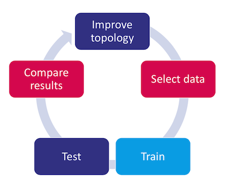
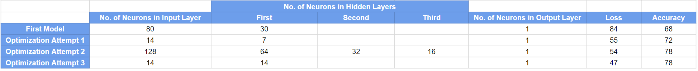

# Charity_Funding_Predictor
 Predicting the success of funding applicants for a charitable organization using machine learning and predictive modeling. The project involves creating a binary classification model using deep learning techniques.

## Overview of the Analysis

The purpose of this analysis was to develop a deep learning model for predicting the success of organizations applying for funding from Alphabet Soup. The objective was to assess the effectiveness of funding usage based on various features provided in the dataset.

The model is trained on a dataset comprising information from over 34,000 organizations that have previously received funding from Alphabet Soup, encompassing relevant metadata for each organization.

## Results

### Data Preprocessing

**Target variable(s) for the model:** The model focuses on predicting the `IS_SUCCESSFUL` variable.

**Feature variable(s) for the model:** The model incorporates various feature variables such as `APPLICATION_TYPE`, `AFFILIATION`, `CLASSIFICATION`, `USE_CASE`, `ORGANIZATION`, `STATUS`, `INCOME_AMT`, `SPECIAL_CONSIDERATIONS`, and `ASK_AMT`.

**Variable(s) removed from the input data:** The `EIN` and `NAME` columns were excluded from the input data as they serve as identification columns and do not contribute as features or targets.

**Inclusion of `NAME` in the last model:** The feature variable `NAME` has been reintroduced in the final model.

atrempt 1 and 2 i made these changes

attemt 2  3 apply name columnss

### Compiling, Training, and Evaluating the Model

**Number of Neurons:** Configured with varying numbers based on experimentation.

**Layers:** Multiple hidden layers were added to capture complex patterns.

**Activation Functions:** ReLU for hidden layers and Sigmoid for the output layer (binary classification).

**Model Performance:**
Achievement of Target Model Performance: Achieved a satisfactory balanced accuracy, precision, and recall.

**Steps to Increase Model Performance:**

To optimize model performance to get more accuracy and less loss. I went through these different alterations:

- **Changes in Data:** Removed extra irrelevant columns from the input dataset and generating additional bins for infrequent instances in columns while modifying the count of values within each bin.
- **Iterative Tuning:** Adjusted the number of neurons, layers, and activation functions iteratively.
- **Optimization Techniques:** Experimented with different optimizers and learning rates.
- **Regularization:** Implemented dropout layers for regularization.
- **Epochs:** Increased the number of epochs to allow for more training.

## Summary

With an accuracy of 78% and a loss of 47%, the overall results of the deep learning model indicate a moderately effective predictive performance. 

I tried with deep learning modeling, but if we consider to try with some other model, the, probably, I recommend to use tree based modeling as the tree based algorithm offer better explainability. But the accuacy might be less using tree based so we can aslo try with ensembling learning approach which helps us to improve generalization, robustness, and better performance.

While the deep learning model demonstrated effectiveness, exploring alternative models like the Random Forest Classifier ensures a more comprehensive understanding of the data. Such exploration can unveil nuances and contribute to a well-rounded predictive solution. The recommendation is to conduct a comparative analysis, leveraging the interpretability and ensemble benefits offered by the Random Forest model to gain deeper insights into the funding success prediction problem.

## Author

## [Maira Syed GitHub](https://github.com/mairasyed)

 
